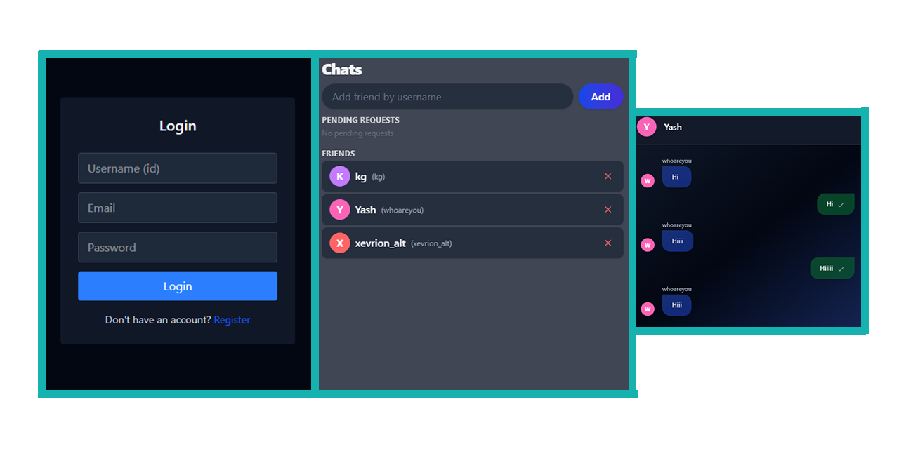

# 🏠 Chat-in-Home

A **real-time**, **secure**, and **minimal** chat application designed for private group communication within a shared environment — be it a home, a hostel, or a small team.


---

## ✨ Features

- 🔐 **Private Real-Time Messaging** – Built using **Socket.IO** for seamless live communication.
- 🧑‍🤝‍🧑 **User-Friendly Interface** – Clean and intuitive UI powered by **React + TailwindCSS**.
- ⚙️ **Backend Powered by Express & MongoDB** – Fast, scalable, and easy to extend.
- 🌐 **Cross-Device Compatible** – Responsive design for desktops and mobile devices.
- 💬 **Typing Indicator**, **User Avatars**, and **Timestamps** – For a modern chat feel.
- 📦 **Modular Codebase** – Easy to understand and contribute to.

---

## 🖼️ Preview

 <!-- Replace with actual screenshot path -->

---

## 🚀 Getting Started

### 1. Clone the Repo

```bash
git clone https://github.com/xevrion/chat-in-home.git
cd chat-in-home
```

### 2. Set Up the Server

```bash
cd server
npm install
```

Create a `.env` file in the `server/` directory:

```env
PORT=5000
MONGODB_URI=your_mongodb_connection_string
```

Start the server:

```bash
npm start
```

### 3. Set Up the Client

Open a new terminal:

```bash
npm install
npm run dev
```

---

## 🧠 Tech Stack

| Frontend | Backend | Database | Real-time |
|----------|---------|----------|------------|
| React + TailwindCSS | Express.js | MongoDB | Socket.IO |

---

## 📁 Folder Structure

```
chat-in-home/
├── client/      # React frontend
├── server/      # Express backend
└── README.md
```

---

## 🛠️ Planned Features

- ✅ Dark & Light Themes
- ✅ Typing Indicators
- ⏳ Notifications on new messages
- ⏳ Emoji Support
- ⏳ Chat Rooms
- ⏳ File Sharing

---

## 🧑‍💻 Contributing

Contributions are welcome! Please fork the repo, make changes, and open a pull request.

```bash
# Create a new branch
git checkout -b feature/your-feature-name
```

---

## 📜 License

This project is licensed under the [MIT License](LICENSE).

---

## 📫 Contact

Made with ❤️ by [Xevrion](https://github.com/xevrion)  
Drop a ⭐ if you like it!
